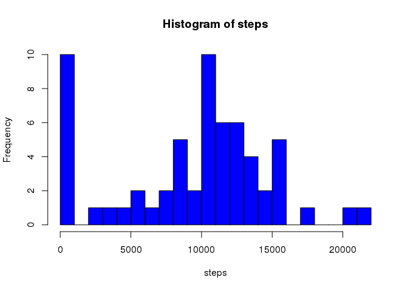
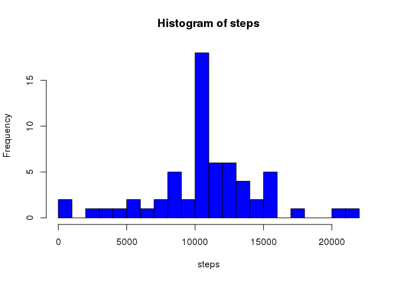
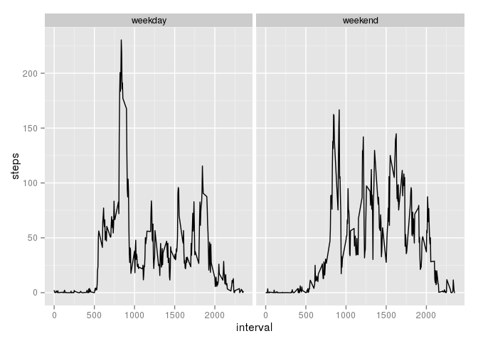

# Reproducible Research: Peer Assessment 1
# Reproducible Research: Peer Assessment 1


## Loading and preprocessing the data


```r
activity <- read.csv(unz('activity.zip', 'activity.csv'), stringsAsFactors=FALSE)
activity <- transform(activity, date=as.Date(date, '%Y-%m-%d'))
```

## What is mean total number of steps taken per day?


```r
library(plyr)

per_day <- ddply(activity, .(date), summarize, steps=sum(steps, na.rm=TRUE))
with(per_day, hist(steps, col='blue', breaks=20))
```

 


```r
mean_per_day <- mean(per_day$steps, na.rm=TRUE)
median_per_day <- median(per_day$steps, na.rm=TRUE)
```

The **mean** total number of steps taken per day is 9354.2.

The **median** total number of steps taken per day is 10395.

## What is the average daily activity pattern?


```r
one_day <- ddply(activity, .(interval), summarize, steps=mean(steps, na.rm=TRUE))
with(one_day, plot(interval, steps, type='l'))
```

 


```r
max_step <- max(one_day$steps)
max_step_time <- one_day$interval[which.max(one_day$steps)]
```

5-minute interval on average across all the days in the dataset,
The maximum number of steps is 206.2, the interval is 835.

## Imputing missing values


```r
total_na <- sum(is.na(activity$steps))
```

Total number of missing values in the dataset is 2304.

Use the mean for that 5-minute interval to fill the missing value.


```r
nomiss <- activity
for (interval in levels(factor(activity$interval))) {
	nomiss[nomiss$interval == interval & is.na(nomiss$steps),]$steps <- 
		mean(nomiss[nomiss$interval == interval,]$steps, na.rm=TRUE)
}
```


```r
nomiss_per_day <- ddply(nomiss, .(date), summarize, steps=sum(steps, na.rm=TRUE))
with(nomiss_per_day, hist(steps, col='blue', breaks=20))
```

 


```r
nomiss_mean_per_day <- mean(nomiss_per_day$steps)
nomiss_median_per_day <- median(nomiss_per_day$steps)
```

The **mean** total number of steps taken per day is 10766.2.

The **median** total number of steps taken per day is 10766.2.

These values differ from the estimates from the first part of the assignment.

The estimates of the total daily number of steps is get larger by imputing missing data.

## Are there differences in activity patterns between weekdays and weekends?


```r
nomiss$weekday <- ifelse(weekdays(nomiss$date) %in% c('Saturday', 'Sunday', '星期六', '星期日'), 'weekend', 'weekday')
nomiss$weekday <- factor(nomiss$weekday)
```


```r
library(ggplot2)

DF <- ddply(nomiss, .(interval, weekday), summarize, steps=mean(steps))
qplot(interval, steps, data=DF, geom='line', facets=~ weekday)
```

 
